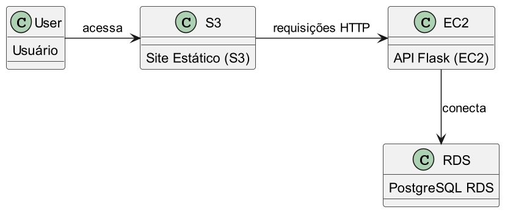

# Guia de Implementação — API FlexMedia

Bem-vindo ao guia de implementação da API FlexMedia! Este material foi criado para alunos iniciantes que desejam aprender a colocar uma aplicação web completa no ar usando a nuvem AWS.

## O que vamos construir

Uma aplicação web com três camadas:

1. **Front-end** — Site estático hospedado em Object Storage / CDN que consome a API.
2. **API (Back-end)** — Aplicação Python/Flask rodando em uma instância EC2.
3. **Banco de Dados** — PostgreSQL gerenciado pelo Amazon RDS.

## Arquitetura

O usuário acessa o front-end estático, que faz requisições HTTP para a API Flask na EC2. A API se conecta ao PostgreSQL no RDS para armazenar e recuperar dados.

## Conteúdo Programático

| Aula | Tema | Descrição |
|------|------|-----------|
| 1 | [Criar a instância EC2](implementation-guide/tutorials/criar-ec2.md) | Criar uma máquina virtual Ubuntu na AWS (Free Tier) |
| 2 | [Criar o banco de dados RDS](implementation-guide/tutorials/criar-rds.md) | Provisionar um PostgreSQL gerenciado na AWS |
| 3 | [Configurar ambiente Python e subir a API](implementation-guide/tutorials/configurar-ambiente.md) | Instalar Python, Flask e rodar a API inicial no EC2 |
| 4 | [Integrar a API com o banco de dados](implementation-guide/tutorials/integrar-api-banco.md) | Conectar a API Flask ao PostgreSQL e criar rotas CRUD |

## Pré-requisitos

- Conta ativa na AWS (Free Tier é suficiente).
- Conhecimento básico de terminal/linha de comando.
- Noções básicas de Python.

## Como usar este material

Siga as aulas na ordem do conteúdo programático. Cada tutorial possui o passo a passo completo com comandos e explicações.
