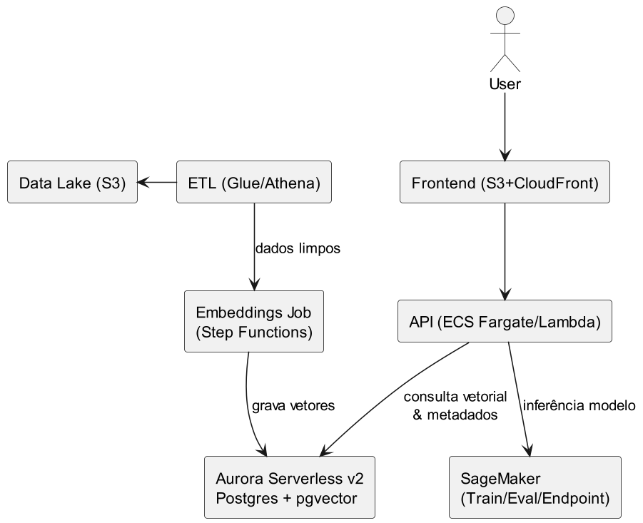

# Nível 2: Modelos e Serviços de ML Gerenciados

Neste nível, a empresa adota serviços gerenciados de machine learning. Em vez de configurar toda a infraestrutura para treinar e servir modelos, utiliza plataformas que abstraem essa complexidade.

## Componentes típicos

| Serviço | Função |
|---------|--------|
| Amazon SageMaker | Treinamento, avaliação e deploy de modelos |
| Aurora Serverless (pgvector) | Banco vetorial gerenciado e escalável |
| Step Functions | Orquestração de pipelines de dados e embeddings |
| Glue / Athena | ETL e consulta em data lakes |

## Arquitetura de exemplo

A API agora se conecta ao SageMaker para inferência de modelos, enquanto pipelines automatizados processam dados, geram embeddings e alimentam o banco vetorial.

## Vantagens

- Menos preocupação com infraestrutura de ML (o serviço gerencia servidores, GPUs, escala).
- Ferramentas integradas para experimentação, treinamento e deploy de modelos.
- Escalabilidade facilitada — o serviço cresce conforme a demanda.

## Desafios

- Menos controle sobre detalhes de baixo nível.
- Custo pode ser maior dependendo do volume de treinamento e inferência.
- Curva de aprendizado dos serviços gerenciados.

## Quando usar

Quando o time já tem dados e precisa treinar modelos próprios, mas não quer gerenciar a infraestrutura de ML manualmente.

---

← Anterior: [Nível 1 — Hardware e Infraestrutura](nivel_1.md) | → Próximo: [Nível 3 — Aplicações e Serviços de IA](nivel_3.md)
