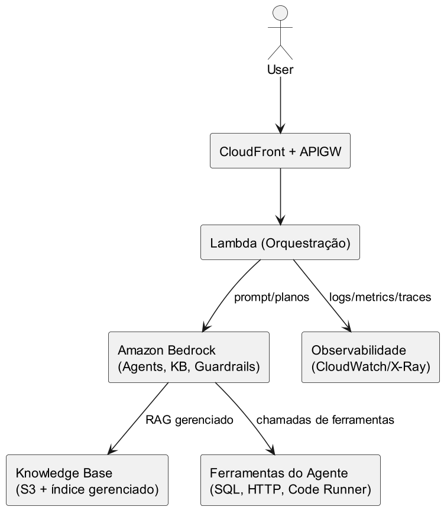

# Nível 3: Aplicações e Serviços de IA

O estágio mais avançado de maturidade. A empresa consome serviços de IA prontos e foca em construir aplicações inteligentes, sem se preocupar com treinamento de modelos ou infraestrutura.

## Componentes típicos

| Serviço | Função |
|---------|--------|
| Amazon Bedrock | Acesso a modelos fundamentais (Claude, Titan, etc.), agentes e guardrails |
| Knowledge Bases | RAG gerenciado com indexação automática de documentos |
| Lambda | Orquestração serverless das chamadas de IA |
| CloudFront + API Gateway | Distribuição e entrada das requisições |
| CloudWatch / X-Ray | Observabilidade (logs, métricas, traces) |

## Arquitetura de exemplo

O usuário faz uma requisição que passa pelo API Gateway, aciona uma Lambda que orquestra chamadas ao Bedrock. O Bedrock pode consultar uma Knowledge Base (RAG) ou acionar ferramentas externas (SQL, HTTP, execução de código) via agentes.

## Vantagens

- Time-to-market muito rápido — não precisa treinar modelos.
- Complexidade operacional mínima — tudo é serverless e gerenciado.
- Foco total no produto e na experiência do usuário.

## Desafios

- Menor customização dos modelos (usa modelos pré-treinados).
- Dependência do provedor de nuvem.
- Custos por requisição podem crescer com o volume.

## Quando usar

Quando o objetivo é entregar valor rápido com IA, sem necessidade de treinar modelos próprios. Ideal para chatbots, assistentes, busca semântica, geração de conteúdo e automação inteligente.

---

← Anterior: [Nível 2 — Modelos e Serviços de ML](nivel_2.md)
